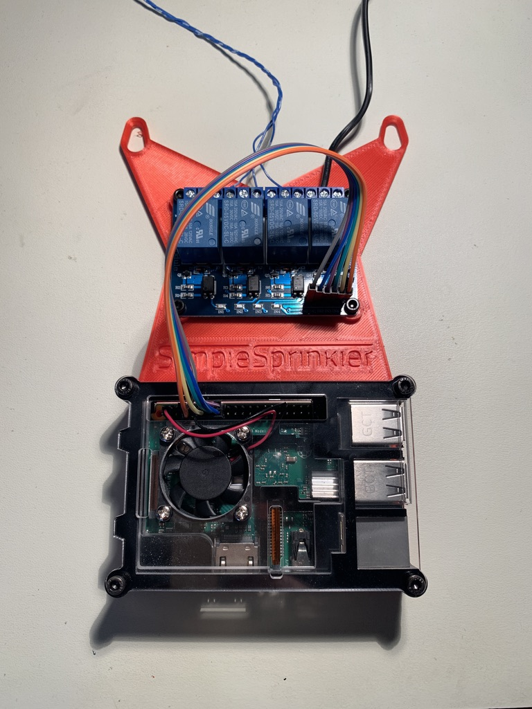
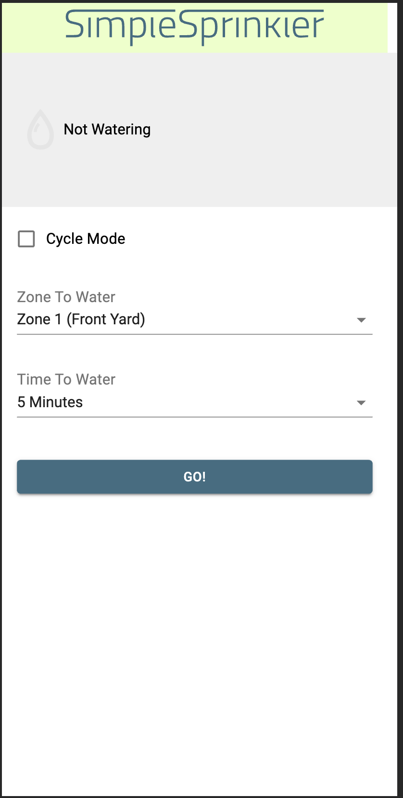

# SimpleSprinkler

A simple DIY Raspberry Pi-based irrigation controller. 

> Note: I haven't spent the time to make the setup super streamlined. You'll need a bit of technical knowledge and willingness to DIY to get this going.

## Assembly

### You will need:
1. Raspberry Pi ([3B used in my build](https://www.buyapi.ca/product/raspberry-pi-3-model-b-armv8-with-1g-ram/), though any should work.)
2. Relay control board [(This one works great)](https://www.amazon.ca/ELEGOO-Channel-Optocoupler-Arduino-Raspberry/dp/B06XCKQ1M9/)
3. SimpleSprinkler Mount - 3D Printed [(Thingiverse)](https://www.thingiverse.com/thing:4794556)
4. Power supply - Use the one that came with your irrigation system. Usually 24V AC ~1A - [something like this](https://www.amazon.ca/Orbit-Sprinkler-System-Transformer-57040/dp/B000VRYVYS)
5. (Optional) Raspberry Pi case/heatsinks/fan, to make it look nice and protect it. [Something like this](https://www.amazon.ca/Smraza-Compatible-Raspberry-Heatsinks-Included/dp/B07TX97C8X). Get extra long screws to go all the way through the case and affix it to the mount.

Print out the SimpleSprinker mount, and mount the Pi and Relay board to it. I used 3mm threaded inserts and 3mm screws for the mounting hardware. 

### Wiring
> Wiring diagram TBC

#### Pi - Relay Board
Connect the Pi's GPIO outputs to the relay control board as below

**VCC/GND**: Connect to any 5V and GND pins on the PI (I used pin **4** for 5V and **6** for GND)
**IN1 - IN3**: Any GPIOs, but I used pins 11(GPIO 17), 13(GPIO 27), 15(GPIO 22), 16(GPIO 23)

#### Relay Board - Sprinklers
Connect each solenoid's switch wire to the "COM" / switch pin on the board (the "middle" one on the Elegoo board)
Connect the solenoid  "HOT"/"SUPPLY" wire to the Power Supply +ve rail
Connect the Power Supply -ve to each of the "NO" pins on each relay. 

With this setup, when the relay switches on it will complete the circuit for the solenoid, connecting it to GND so current can flow from the power supply +ve, through the solenoid, and to -ve.

*Wired Up*
 

## Configuration

### Pi Install
Get the Raspberry Pi set up by installing [nodejs](https://nodejs.org) v12 or later.

Clone this repo to the Raspberry Pi.

### Config

Edit the relay config in `src/RELAYS.js`, to match up with the specific GPIOs and logic levels for your board.

Edit the display of the Watering Zones in `src/frontend-app/src/components/Form.js` (do a search for "option" and change the text to match your specific irrigation setup. May take some trial and error to get the names right)

Now, run `npm install` to install node modules

## Running it!

Start the app from the top of the directory with `npm run start`, this will run the controller code, as well as serve the frontend app on port 3000.

Grab your Pi's IP Address with `hostname -I` 

Open a browser on the local network, and navigate to `http://<pi-ip>:3000` . You should see the SimpleSprinkler UI

## Usage

Usage is pretty straightforward. Select a zone and length of time, then press "Go" to begin watering. If "Cycle mode" is checked, the pi will cycle through each of the zones for the specified time.

The webapp will continuously poll the server for updated status. Thus, you can start it on one browser and view it from another and they should stay in sync! 

## Tips
Start the SimpleSprinkler service on boot by editing your `/etc/rc.local` file and adding `sudo node /home/pi/simple-sprinkler/src/server.js &` to the bottom of the file.

## Things to improve / TBC
- Break out relevant config (GPIOs, zone mappings) into separate config file for easy setup
- Build an executable instead to run everything, removing dependency on Node
- Websockets for UI instead of continuous HTTP polling
- Wiring diagram docs
- Secure Cloud deployment options so you can water from anywhere
